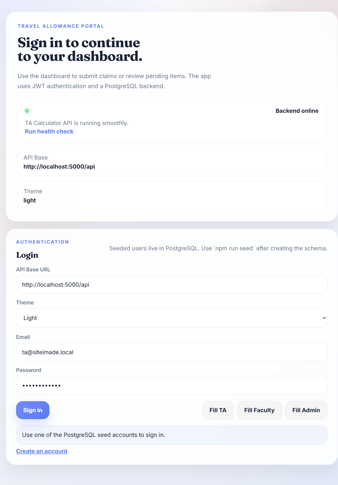
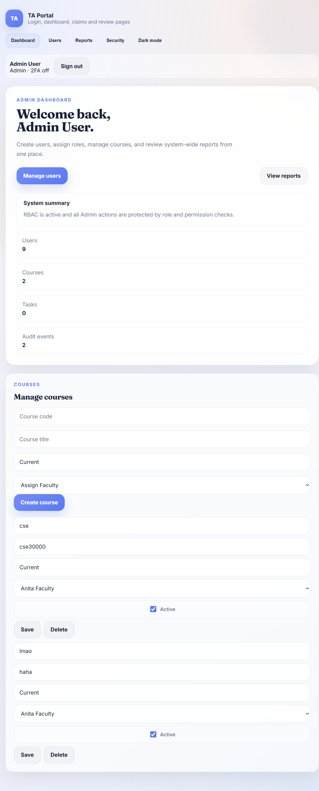
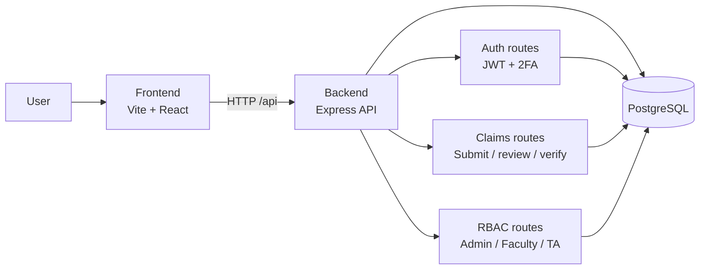

<div align="center">

# TA Calculator

<p><strong>Travel allowance claims, RBAC, and two-factor login in one internship project.</strong></p>

<p>
  
  
  
</p>

</div>

## Overview

TA Calculator is a full-stack travel allowance claim system with a Node.js API, a Vite + React frontend, PostgreSQL persistence, role-based access control, and optional two-factor authentication.

## Screenshots

| Login | Admin dashboard |
| --- | --- |
|  |  |

These screenshots were captured from the running local project.

## Architecture



## What is included

- Claim submission and approval flows.
- JWT-based authentication.
- RBAC for Admin, Faculty, and TA-style user roles.
- TOTP-based two-factor authentication setup and verification.
- PostgreSQL schema, migrations, and seed scripts.

## Repository Layout

| Path | Purpose |
| --- | --- |
| `backend/` | Express API, database bootstrap, migrations, and seed scripts. |
| `frontend/` | Vite + React single-page app. |
| `requirements.txt` | Optional Python tooling for local development. |

## Requirements

- Node.js 18 or newer.
- `npm`.
- PostgreSQL 18 or compatible.
- Optional: Python 3.10+ if you want the helper tooling in `requirements.txt`.

## Quick Start

1. Open the repository root in your editor.
2. Set up the backend database and environment.
3. Start the backend API.
4. Start the frontend app in a second terminal.

## Help section to get started

If you zip this repository and upload it to Drive, the simplest run path for you is:

1. Install Node.js and PostgreSQL.
2. Open pgAdmin and create a non-superuser login role plus the `ta_calculator` database.
3. Edit [backend/.env.example](backend/.env.example) as [backend/.env](backend/.env) and fill in `DB_PASSWORD` and `JWT_SECRET`.
4. From the repository root, run:

   ```powershell
   powershell -ExecutionPolicy Bypass -File .\setup.ps1
   ```

5. Start the app:

   ```powershell
   cd backend
   npm run dev
   ```

   In a second terminal:

   ```powershell
   cd frontend
   npm run dev
   ```

The database still needs one-time setup in pgAdmin, but everything else is kept in the repository so the run steps stay short.

## Backend Setup

1. Install backend dependencies.

   ```powershell
   cd backend
   npm install
   ```

2. In pgAdmin, create a dedicated local PostgreSQL login role for this project. Do not use your superuser for the app.

   - Right-click **Login/Group Roles** -> **Create** -> **Login/Group Role**.
   - Set the name to something like `ta_app`.
   - In **Definition**, set a strong password.
   - In **Privileges**, enable **Can login** and **Create DB**.
   - Leave **Superuser** disabled.

3. Create the project database and make that role the owner.

   - Right-click **Databases** -> **Create** -> **Database**.
   - Set the database name to `ta_calculator`.
   - Set **Owner** to the role you just created, for example `ta_app`.

4. Create `backend/.env` with the non-superuser database credentials and a JWT secret. Use your own local values and keep the file out of version control.

   ```env
   PORT=5000
   DB_HOST=localhost
   DB_PORT=5432
   DB_USER=ta_app
   DB_PASSWORD=your_local_db_password
   DB_NAME=ta_calculator
   JWT_SECRET=your_long_random_jwt_secret
   ```

   To generate a strong JWT secret quickly on Windows PowerShell:

   ```powershell
   [Convert]::ToBase64String([byte[]](1..64 | ForEach-Object { Get-Random -Maximum 256 }))
   ```

5. Initialize the database and seed the demo data.

   ```powershell
   npm run db:setup
   npm run seed
   ```

6. Start the backend in development mode.

   ```powershell
   npm run dev
   ```

If you prefer SQL instead of the pgAdmin UI, run this once while connected as a superuser, then switch to the new role for all project work. Replace the password placeholder with your own value:

```sql
CREATE ROLE ta_app LOGIN PASSWORD 'your_local_db_password' CREATEDB;
CREATE DATABASE ta_calculator OWNER ta_app;
```

## Frontend Setup

1. Install frontend dependencies.

   ```powershell
   cd frontend
   npm install
   ```

2. Start the frontend dev server.

   ```powershell
   npm run dev
   ```

3. Build the frontend for production.

   ```powershell
   npm run build
   ```

## Useful Scripts

### Backend

- `npm run start` starts the API with Node.
- `npm run dev` starts the API with `nodemon`.
- `npm run seed` loads demo users and sample data.
- `npm run db:setup` runs the Windows PostgreSQL bootstrap helper.
- `npm run db:setup:raw` runs the raw Node bootstrap script.
- `npm run migrate:rbac` applies the RBAC migration.

### Frontend

- `npm run dev` starts the Vite development server.
- `npm run build` creates a production build.
- `npm run preview` previews the production build locally.

## Project Highlights

- The backend exposes auth, claims, and RBAC routes under `/api`.
- The frontend supports login, dashboard, claims, review, and security flows.
- Demo accounts are included for local testing after seeding the database.
- The backend bootstrap script is intended for first-time setup or schema refreshes, not every startup.

## Demo Accounts

After seeding, you can sign in with these example users:

- `employee@siteimade.local` / `Password123!`
- `accounts@siteimade.local` / `Password123!`
- `admin@siteimade.local` / `Password123!`

## Security Notes

- Keep `.env` files, keys, and other secrets out of version control.
- Use a strong randomly generated `JWT_SECRET` value in local and deployed environments.
- Enable two-factor authentication for accounts that need additional protection.

## Optional Python Tooling

If you want the local Python helper tools, install them from the repository root:

```powershell
pip install -r requirements.txt
```

## Contributing

Keep changes focused, test the relevant flows, and document any new setup requirements in this README.

## License

